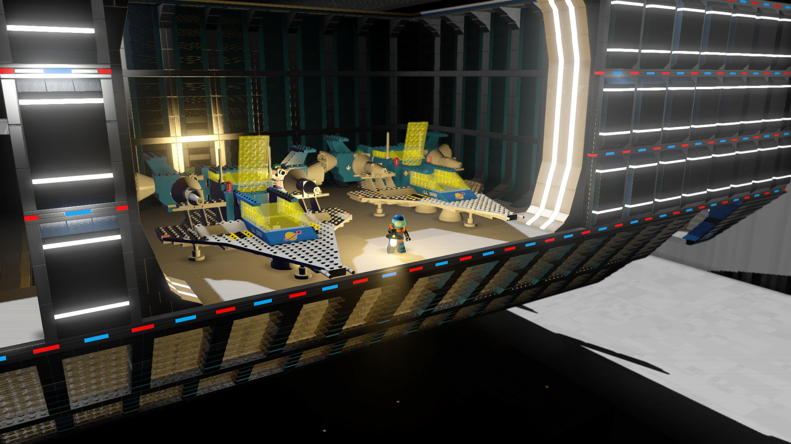
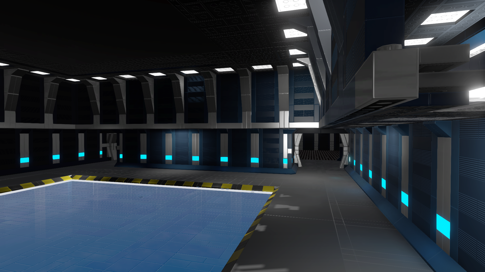
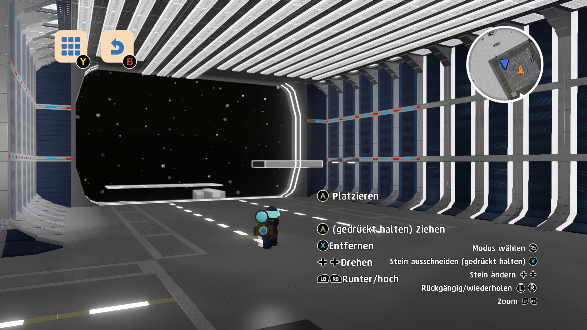

# Prefabs WorkShop

Prefabs WorkShop is a collection of prefab structures created by **Mark Lehmbach ("Schnitter")**, mainly for use in **LEGO® Worlds** or similar creative environments.  
It contains ready-made **interiors, exteriors, hangars, and modular parts** that can be easily imported into your projects.

---

## 📸 Screenshots

Example Prefabs included:

### Exterior Example


### Interior Example


### Hangar Example


*(Add your own screenshots in a `screenshots/` folder for better visualization.)*

---

## 🚀 Installation

1. **Clone or Download** this repository:
   ```bash
   git clone https://github.com/Schnitter/Prefabs-WorkShop.git
   ```

2. **Locate your LEGO Worlds save directory** (usually found in your user profile under  
   `Documents\Warner Bros. Interactive Entertainment\LEGO Worlds\SaveGames`).

3. Copy the prefabs (`.lxfml` / `.lxf` or other prefab formats) from this repository into the  
   appropriate **CustomContent** or **Import** folder inside your save directory.

4. Start LEGO Worlds (or your target software/game engine) and load the prefab from the workshop menu.

---

## 🛠 Usage

- Browse through the prefab folders (`Interior/`, `Exterior/`, `Hangar/`).
- Select a prefab and import it into your project.
- Prefabs are **modular**: you can combine different pieces to create larger scenes.  
- **Example workflow in LEGO Worlds**:
  1. Open the in-game brick builder / world editor.
  2. Select "Import Prefab".
  3. Choose one of the provided files.
  4. Place it into your world and adjust as needed.

---

## 📂 Repository Structure

```
Prefabs-WorkShop/
│
├── Interior/        # Prefabs for interior spaces
├── Exterior/        # Prefabs for building facades and outdoor scenes
├── Hangar/          # Large-scale hangar structures
├── LICENSE          # CC BY-NC-ND 4.0 License
└── README.md        # This documentation
```

---

## 📜 License

This project is licensed under  
**Creative Commons Attribution-NonCommercial-NoDerivatives 4.0 International (CC BY-NC-ND 4.0)**  

- ✅ Share and redistribute with attribution  
- ❌ No commercial use  
- ❌ No derivative works / modified versions may be distributed  

---

## 👤 Author

- **Mark Lehmbach ("Schnitter")**  
- GitHub: [Schnitter](https://github.com/Schnitter)  

---

## 💡 Contributing

Due to the license restrictions, contributions are limited to:  
- Reporting issues  
- Suggesting new prefab ideas  
- Requesting additional prefab types  

Direct modifications cannot be redistributed.  

---

# 🇩🇪 Prefabs WorkShop (Deutsch)

Prefabs WorkShop ist eine Sammlung von vorgefertigten Strukturen, erstellt von  
**Mark Lehmbach („Schnitter“)**, hauptsächlich für **LEGO® Worlds** oder ähnliche Kreativumgebungen.  
Enthalten sind **Innenräume, Außenansichten, Hangars und modulare Bauteile**, die leicht in eigene Projekte eingebunden werden können.

---

## 📸 Screenshots

Beispiel-Prefabs:

### Außenbereich


### Innenraum


### Hangar


*(Füge eigene Screenshots in den Ordner `screenshots/` ein, um die Inhalte zu veranschaulichen.)*

---

## 🚀 Installation

1. **Repository herunterladen oder klonen**:
   ```bash
   git clone https://github.com/Schnitter/Prefabs-WorkShop.git
   ```

2. **Speicherordner von LEGO Worlds finden** (meist unter  
   `Dokumente\Warner Bros. Interactive Entertainment\LEGO Worlds\SaveGames`).

3. Die Prefabs (`.lxfml` / `.lxf` oder andere Formate) aus diesem Repository in den Ordner  
   **CustomContent** oder **Import** im Spielverzeichnis kopieren.

4. LEGO Worlds starten und das Prefab über das Workshop-Menü laden.

---

## 🛠 Verwendung

- Durchsuche die Prefab-Ordner (`Interior/`, `Exterior/`, `Hangar/`).  
- Wähle ein Prefab und importiere es in dein Projekt.  
- Prefabs sind **modular**, sodass du verschiedene Teile kombinieren kannst.  

**Beispiel-Workflow in LEGO Worlds**:
1. Im Spiel den Baumeister-/Welteditor öffnen.  
2. „Prefab importieren“ auswählen.  
3. Datei aus diesem Repository auswählen.  
4. Prefab in die Welt platzieren und nach Wunsch anpassen.  

---

## 📂 Struktur

```
Prefabs-WorkShop/
│
├── Interior/        # Innenräume
├── Exterior/        # Außenbereiche und Fassaden
├── Hangar/          # Großstrukturen (Hangars)
├── LICENSE          # CC BY-NC-ND 4.0 Lizenz
└── README.md        # Diese Dokumentation
```

---

## 📜 Lizenz

Lizensiert unter  
**Creative Commons Attribution-NonCommercial-NoDerivatives 4.0 International (CC BY-NC-ND 4.0)**  

- ✅ Teilen und weitergeben mit Namensnennung  
- ❌ Keine kommerzielle Nutzung  
- ❌ Keine Bearbeitung/Veränderung zur Weitergabe  

---

## 👤 Autor

- **Mark Lehmbach („Schnitter“)**  
- GitHub: [Schnitter](https://github.com/Schnitter)  

---

## 💡 Mitwirken

Durch die Lizenz sind Beiträge eingeschränkt:  
- Fehler melden  
- Neue Ideen oder Prefab-Wünsche vorschlagen  
- Weitere Prefab-Typen anfragen  

Direkte Änderungen dürfen nicht weiterverteilt werden.  
